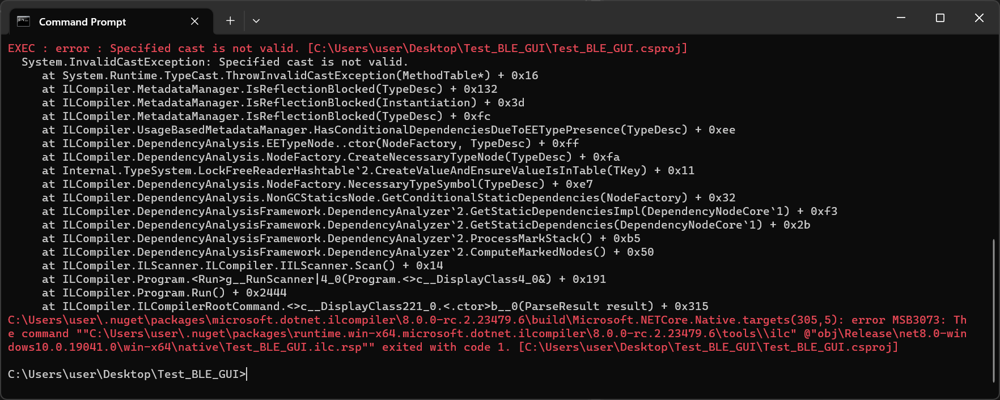
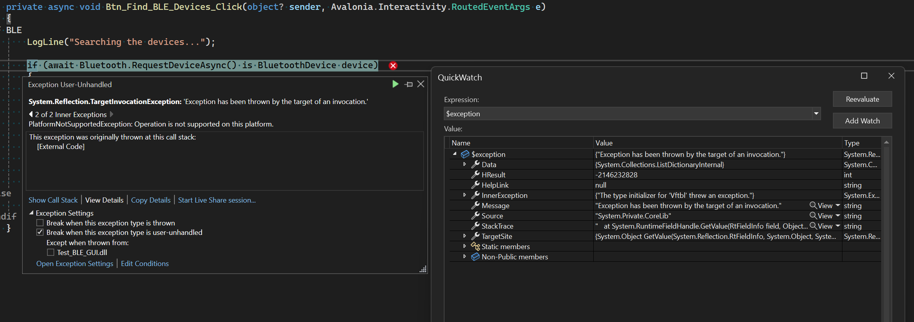

The problem is I can't build and run it with ``PublushAot`` option on.

```xml
<OutputType>WinExe</OutputType>
<TargetFramework>net8.0-windows10.0.19041.0</TargetFramework>
<PublishAot>true</PublishAot>
```

Using Avalonia packages and 
```xml
<PackageReference Include="InTheHand.BluetoothLE" Version="4.0.34" />
```

If I disable Bluetooth functionality it works, commenting ``#define BLE`` in [MainWindow.axaml.cs](http://github.com).

Tried it on Windows 11, with DotNet Preview (8.0.100-rc.2.23502.2) installed as

> winget install Microsoft.DotNet.SDK.Preview

Publish.cmd is

> dotnet publish -c Release -r win-x64 -o Output

This results in:



Trying to launch the application will show following exception when I hit Get Device button:


